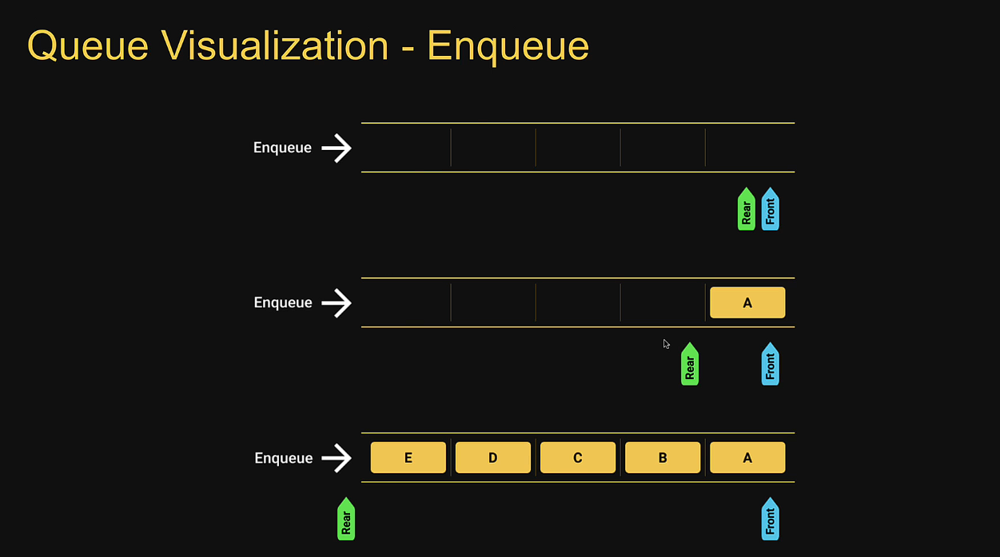
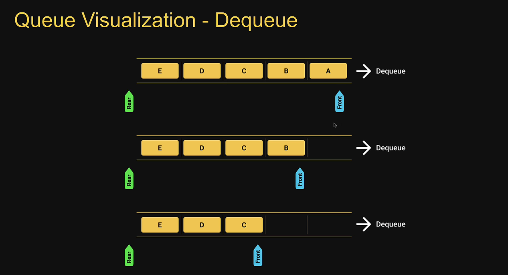

# Data Strucures in JavaScript 

### 1.  Set Data Structure:- 

> - A Set is a data structure that can hold collection of values. The values howver must be unique.
> - Set can contain a mix of different data types. You can store strings, booleans, numbers or even objects all in same set.
> - Sets are dynamically sized. You don't have to declare the size of a set before creating it.
> - Sets do not maintain an insertion order.
> - Sets are iterables. They can be used with a for of loop.

##   Set vs Array

> - Arrays can contain duplicate values whereas Set can't.
> - Insertion order is maintained in Arrays but it's not the case with Sets.
> - Searchin and deleting an element in the Set is faster compared to Arrays.

### 2.  Map Data Structure:-

> - A map is an unordered collection of key-value pairs. Both Keys and values can be of any data type
> - To retrieve a value, you can use the corresponding key
> - Maps are iterables. They can be used with a for of loop

##   Object vs Map
> - Objects are unordered whereas maps are ordered.
> - Keys in objects can only be string or symbol type where as in maps, they can be of any type.
> - An object has a prototype and may contain a few default keys which may collide with your own keys if you're not careful. A Map on the other hand does not contain any keps by default.
> - The numbers of items in an object must be determined manually where as it is readily available with the size property in a map.
> - Apart from storing data, you can attach functionally to an object where as maps are restricted to just storing data.

### 3.  Stack Data Structure:-

> - The stack data structure is a sequential collection of elements that follows the principle of last in first out (LIFO)
> - The last element inserted into the stack is first element to be removed.
> - A stack of plates. The last plate placed on top of the stack is also the first plate removed from the stack.
> - Stack is an abstract data type. It is defined by its behaviour rather than being a mathematical model.
> ### The Stack data structure supports two main operations:-
>> - Push, which adds an element to the collection
>> - Pop, which removes the most recently added element from the collection.

> ### Stack Usage:-
> - Browser history tracking
> - Undo Operation when typing
> - Expression conversions
> - Call stack in JavaScript runtime

### 4.  Queue Data Structure:-

> - The queue data structure is a sequential collection of elements that follows the principle of First in First out (FIFO).
> - The first element inserted into the queue is first element to be removed.
> - A queue of people. People enter the queue at one end (rear/tail) and leave the queue from the other end (front/head).
> - Queue is an abstract data type. It is defined by its behaviour rather than being a mathematical model.
> ### The Queue data structure supports two main operations:-
>> - Enqueue, which adds an element to the rear/tail of the collection.
>> - Dequeue, which removes an element from the front/head of the collection.

> ### Queue Usage
> - Printers
> - CPU task scheduling
> - Callback queue in JavaScript runtime 